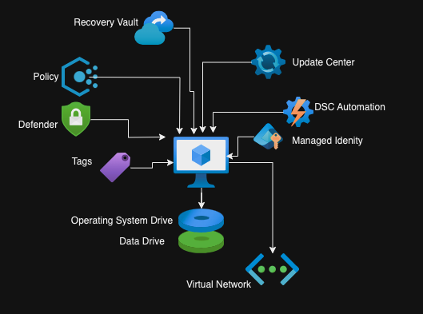
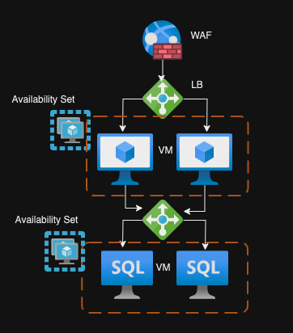

## How to Approach a Cloud Centre of Excellence (CCoE) Correctly

The Cloud Centre of Excellence (CCoE) is the unsung hero (or sometimes the villain) of many organisations’ cloud journeys. Done right, it’s a powerhouse driving innovation, standardisation, and streamlined delivery. Done wrong, it’s where good initiatives go to die, buried under layers of bureaucracy and over-complication. 

A successful CCoE isn’t just a team of senior architects and engineers sitting in an ivory tower. It’s a collaborative hub working hand-in-glove with application teams and business stakeholders. Think of it as the friendly neighbourhood mentor—approachable, knowledgeable, and always ready to enable success.


## Business Planning and Roadmaps

Without a solid business roadmap, your CCoE is like a GPS with no destination. Working with business leaders and application owners to forecast future needs is critical. Not only does this keep everyone aligned, but it also prevents your CCoE from being blindsided by sudden requests that feel like they’ve emerged from an IT black hole.

### How to Stay Ahead:
- **Align with Objectives**: Regularly review business goals and ensure cloud initiatives support them.
- **Forecasting**: Maintain a rolling forecast of expected infrastructure, application, and service needs.
- **Agility**: Build a framework for quick pivots—because if there’s one constant in IT, it’s change.

> **Pro Tip**: A great CCoE doesn’t just anticipate needs—it identifies trends. ("We’re seeing a 70% chance of AI workloads this quarter. Better pack an umbrella for those data models!")


## Standards and Documentation

Documentation often has a bad reputation—necessary but tedious. In cloud environments, the key is to keep it lean, accessible, and baked into the tools your teams already use.

### Best Practices for Documentation:
1. **Integrate with Code**: Keep standards alongside the code they represent, such as `README.md` files with deployment templates.
2. **Make It Visual**: Use diagrams to translate complex configurations into easily digestible visuals.
3. **Avoid Overkill**: Keep documentation concise and to the point, ensuring it’s useful without being overwhelming.


## Landing Zones

Landing Zones are the foundation of your cloud environment. They define the operating standards that ensure every application deployed adheres to best practices without manual intervention. Think of them as a "cloud runway" where every plane lands smoothly—no turbulence allowed.

### Focus on Application Landing Zones
A well-crafted Landing Zone offers a seamless "vending experience" for application teams. These should cater to various workload types, such as:
- **Data Landing Zones**: For analytics, reporting, and data lake solutions.
- **Container Landing Zones**: For microservices and container-based workloads.
- **AI Landing Zones**: Tailored for machine learning and AI initiatives.


## Modules

Modules are the building blocks of cloud standards. They encapsulate configurations for specific resource types, ensuring consistency across deployments. Think of them as Lego bricks—simple, reusable, and essential for building bigger solutions.

### Example Module Structure:
```plaintext
Modules-Repo
│
├── Virtual-Machine
│   ├── Module-Code.tf          # Terraform module
│   ├── README.md               # Usage instructions
│   ├── diagram.png             # Visual aid
│   └── design-building-block   # Optional collateral
└── ...
```

### Example Visual:



## Patterns

Patterns are collections of modules that define end-to-end deployment blueprints. If modules are the bricks, patterns are the architectural plans. They enable teams to deploy with confidence, knowing they’re using proven designs.

### Example Pattern:
A **two-tier HA application** using virtual machines might include:
- A Web Application Firewall for secure access.
- A load balancer for traffic distribution.
- Highly available VMs in availability groups.

### Example Visual:



## Review Processes and Continuous Improvement

Technology evolves rapidly, and your CCoE must keep pace. Continuous improvement ensures your standards, patterns, and documentation remain relevant as new technologies emerge and business needs shift.

### Regularly Review These Areas:
1. **Modules**: Update modules as cloud providers release new features or deprecate old ones. For example:
   - Add support for new Terraform providers or Azure resources.
   - Address deprecation warnings before they become critical issues.

2. **Patterns**: Evolve patterns to include emerging architectures, like serverless or edge computing, or adjust for scalability and cost optimisation.

3. **Landing Zones**: Revisit security, compliance, and governance policies to align with industry standards and organisational requirements.

4. **Knowledge Base (KB)**: Keep documentation current by incorporating new insights and lessons learned. Outdated guides can lead to errors and inefficiencies.

### Tips for Continuous Improvement:
- **Feedback Loops**: Gather input from application teams about what’s working and what isn’t.
- **Regular Audits**: Schedule periodic reviews of your standards, modules, and patterns.
- **Automate Testing**: Use CI/CD pipelines to validate updates before deployment.
- **Upskilling**: Invest in training to ensure your team stays ahead of the curve.

> **Pro Tip**: Think of your CCoE as a high-performance engine—regular tuning keeps it running smoothly. Neglect it, and you’re asking for a breakdown.


## As-Built Documentation

As-built documentation was once a cornerstone of legacy infrastructure. However, in dynamic cloud environments, static as-builts are relics of the past—useful once, but quickly outdated and cumbersome to maintain.

### Why Traditional As-Builts Don’t Work:
1. **High Maintenance**: Manual updates can’t keep up with the pace of cloud changes.
2. **Resource Intensive**: Creating and maintaining as-builts is time-consuming.
3. **Error-Prone**: Manual processes often lead to inaccuracies.

### Automate As-Builts:
Tools like **Lucidchart**, **Terraform Graph**, and cloud-native services (e.g., Azure Resource Manager) can automate the generation of as-builts, ensuring accuracy and reducing overhead.

#### Benefits of Automation:
- **Always Up to Date**: Reflects the current state of your environment.
- **Less Overhead**: Frees up your team for higher-value tasks.
- **Improved Accuracy**: Minimises human error in documentation.

> **Pro Tip**: Automated as-builts should be treated as living documents—review them periodically and ensure they’re easily accessible to all stakeholders.


## The Right Mindset for a CCoE

The success of a CCoE hinges on its mindset. It’s not just about enforcing standards; it’s about enabling teams to move faster, smarter, and more confidently. A CCoE should be:
- **Collaborative**: Engage with application teams to address challenges and share knowledge.
- **Pragmatic**: Balance best practices with flexibility to meet real-world needs.
- **Visionary**: Stay ahead of the curve without losing sight of operational excellence.

By embedding these principles, your CCoE can be the driving force behind your organisation’s cloud success. Build wisely, iterate often, and let your CCoE thrive.


